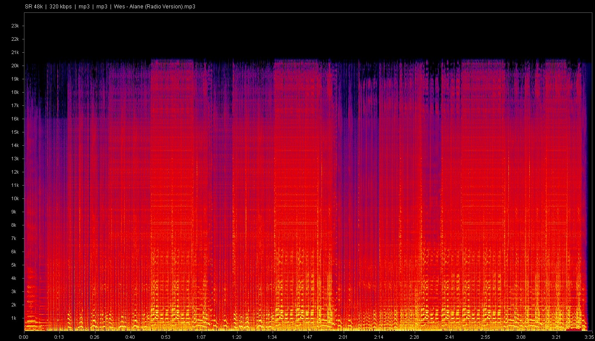

# Spectrogram Context Menu

A lightweight Windows 10/11 utility that adds **Show spectrogram** to the
context menu of audio files. It generates a detailed PNG spectrogram with
FFmpeg, adds frequency and time axes, audio metadata, and opens the result in
your default image viewer.



[Russian installation guide](INSTALL_GUIDE_RU.md)

## Highlights

- A single self-installing `SpectrogramContextMenu.exe` distribution file.
- Per-user installation without administrator privileges or `regsvr32`.
- MP3, FLAC, WAV, OGG, M4A, AAC, WMA, OPUS, APE, and AC3 support.
- 1280 x 720 logarithmic intensity spectrograms.
- Sample rate, bitrate, format, codec, filename, frequency, and time labels.
- Install, update, repair, and uninstall modes in the same executable.
- FFmpeg is discovered through `PATH` and is never bundled or downloaded.

## Requirements

- Windows 10 or Windows 11 x64.
- `ffmpeg.exe` and `ffprobe.exe` available through `PATH`.

Verify FFmpeg in a new Command Prompt:

```bat
where ffmpeg.exe
where ffprobe.exe
```

Both commands must print a full path. If you recently changed `PATH`, sign out
of Windows and sign back in so File Explorer receives the updated environment.

## Installation

1. Download `SpectrogramContextMenu.exe` from the
   [latest release](https://github.com/AsSergjo/specshell/releases/latest).
2. Run the downloaded executable.
3. Right-click a supported audio file and choose **Show spectrogram**.

The app installs itself to:

```text
%LocalAppData%\Programs\SpectrogramContextMenu
```

It registers only under `HKEY_CURRENT_USER`, so UAC elevation is not required.
On Windows 11, the command is located under **Show more options** because this
release uses a safe static shell verb instead of an in-process Explorer DLL.

## Maintenance

Running a newer downloaded EXE installs the update over the existing version.
The following command-line modes are also available:

```bat
SpectrogramContextMenu.exe /repair
SpectrogramContextMenu.exe /uninstall
```

You can also uninstall the utility from Windows **Installed apps**.

## Build

Open **x64 Native Tools Command Prompt for VS 2022**, change to the repository
directory, and run:

```bat
build.bat
```

The resulting `SpectrogramContextMenu.exe` is created in the repository root.

Alternatively, use CMake:

```bat
cmake -S . -B build -G "Visual Studio 17 2022" -A x64
cmake --build build --config Release
```

The CMake output is `build\Release\SpectrogramContextMenu.exe`.

## How it works

The executable serves as both installer and runtime application. Installation
copies it into the current user's profile and creates static shell verbs under
`HKCU\Software\Classes\SystemFileAssociations`. Selecting the command starts
the installed EXE with the audio file path. FFmpeg creates `%TEMP%\spec.png`,
then GDI+ adds labels and metadata before the image is opened.

No code is injected into `explorer.exe`.

## License

Licensed under the [MIT License](LICENSE).
